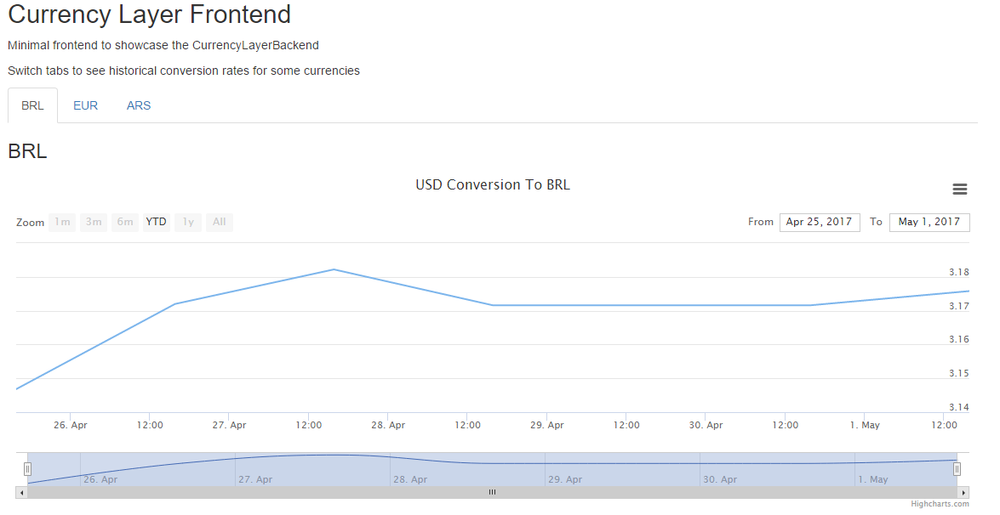

# Currency Layer

## About

A backend server built on .Net with a minimalist frontend to showcase recent currencies conversion rates.

## Installation

To build the backend you'll need .Net Framework 4.6.2 and a Currency Layer Api Access Key in the App.config.

## Usage

Run server and access the frontend through the index.html

## Authors
- Leonardo Teixeira Menezes
